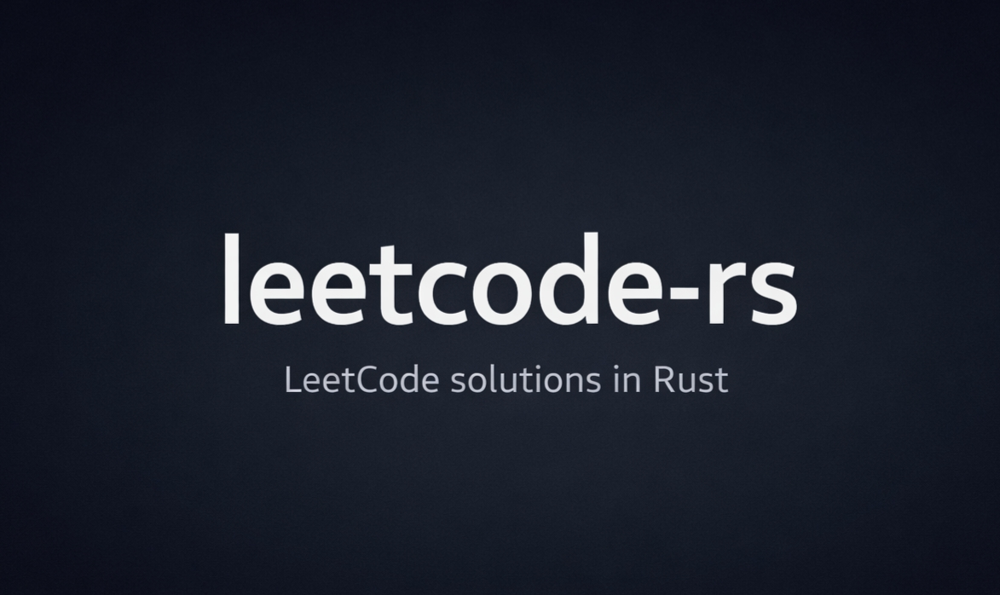

# LeetCode Solutions (Rust)

This repository contains a curated collection of LeetCode solutions written in Rust,
with a focus on clarity, correctness, and maintainable documentation.

The repository is updated daily as part of a personal challenge to solve one
LeetCode problem per day.

> A browsable web version of this repository is available on the [project website](https://mzyui.github.io/leetcode-rs//).

## Statistics

**Total Problems Solved:** 18

| Difficulty | Count |
|------------|-------|
| Easy       | 4     |
| Medium     | 12     |
| Hard       | 2     |

> This is a documentation-focused repository.  
> Individual problems are documented in detail under the `problems/` directory.


## Quick Navigation

- [Problems 1-10](#problems-1-10)
- [Problems 11-20](#problems-11-20)


<a id="problems-1-10"></a>
## Problems 1-10

| # | Problem | Difficulty | Category |
|---|--------|------------|----------|
| 1 | [Two Sum](problems/001-two-sum.md) | Easy | algorithms |
| 2 | [Add Two Numbers](problems/002-add-two-numbers.md) | Medium | algorithms |
| 3 | [Longest Substring Without Repeating Characters](problems/003-longest-substring-without-repeating-characters.md) | Medium | algorithms |
| 4 | [Median Of Two Sorted Arrays](problems/004-median-of-two-sorted-arrays.md) | Hard | algorithms |
| 5 | [Longest Palindromic Substring](problems/005-longest-palindromic-substring.md) | Medium | algorithms |
| 6 | [Zigzag Conversion](problems/006-zigzag-conversion.md) | Medium | algorithms |
| 7 | [Reverse Integer](problems/007-reverse-integer.md) | Medium | algorithms |
| 8 | [String To Integer Atoi](problems/008-string-to-integer-atoi.md) | Medium | algorithms |
| 9 | [Palindrome Number](problems/009-palindrome-number.md) | Easy | algorithms |
| 10 | [Regular Expression Matching](problems/010-regular-expression-matching.md) | Hard | algorithms |

[Back to top](#leetcode-solutions-rust)


<a id="problems-11-20"></a>
## Problems 11-20

| # | Problem | Difficulty | Category |
|---|--------|------------|----------|
| 11 | [Container With Most Water](problems/011-container-with-most-water.md) | Medium | algorithms |
| 12 | [Integer To Roman](problems/012-integer-to-roman.md) | Medium | algorithms |
| 13 | [Roman To Integer](problems/013-roman-to-integer.md) | Easy | algorithms |
| 14 | [Longest Common Prefix](problems/014-longest-common-prefix.md) | Easy | algorithms |
| 15 | [3sum](problems/015-3sum.md) | Medium | algorithms |
| 16 | [3sum Closest](problems/016-3sum-closest.md) | Medium | algorithms |
| 17 | [Letter Combinations Of A Phone Number](problems/017-letter-combinations-of-a-phone-number.md) | Medium | algorithms |
| 18 | [4sum](problems/018-4sum.md) | Medium | algorithms |

[Back to top](#leetcode-solutions-rust)


## Repository Structure

```text
leetcode-rs/
├── docs/             # Auto-generated documentation
├── solutions/        # Original Rust solution files (source of truth)
├── problems/         # Auto-generated per-problem documentation
├── src/              # Analysis-only crate root (rust-analyzer)
├── tools/            # Synchronization tooling
├── Cargo.toml        # Minimal Cargo manifest
└── README.md         # Repository overview
```


## Tooling and Synchronization

A custom synchronization tool (`sync_leetcode`) is used to keep solution
files, documentation, and metadata in sync.

```bash
cd ~/leetcode-rs
rustc tools/sync_leetcode.rs -O -o tools/sync_leetcode
./tools/sync_leetcode
./tools/sync_leetcode 100
```


## Scope and Design Goals

- Readable and idiomatic Rust solutions
- No execution or benchmarking
- Deterministic, auto-generated documentation
- Strong IDE support via rust-analyzer


## Notes

- `solutions/` is the single source of truth
- Files under `problems/` and `src/` are auto-generated
- Manual edits to generated files will be overwritten


## Credits

- LeetCode platform
- leetcode-cli by clearloop ([GitHub repository](https://github.com/clearloop/leetcode-cli))
- Tooling (`sync_leetcode`) was developed with assistance from an AI language model (ChatGPT, GPT-5).


## Disclaimer

This repository is independently maintained and is not affiliated with, endorsed by,
or sponsored by LeetCode. All problem descriptions remain the property of their
respective owners.

---

<small>*Auto-generated by `sync_leetcode`. Manual changes may be overwritten.*</small>
